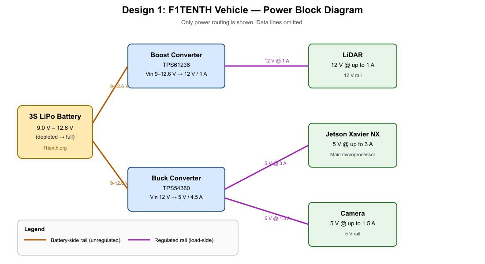
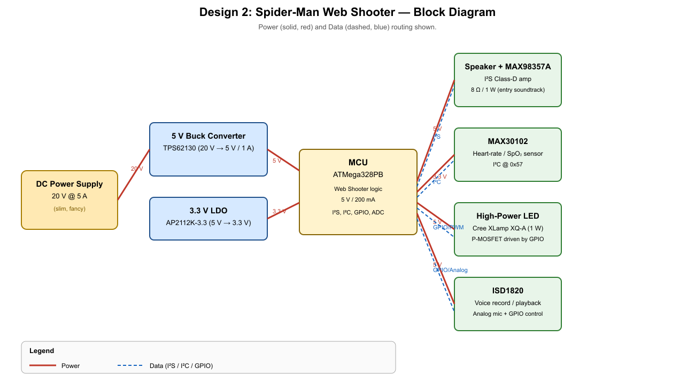

# WS1 – Power Management Submission

This repository contains my answers for **WS1 – Power Management**.

The full problem statement is in [`WS1 - Power.md`](WS1%20-%20Power.md). All part choices are recorded in [`WS1 - Power - Sample BOM.xlsx`](WS1%20-%20Power%20-%20Sample%20BOM.xlsx) (tabs **Design 1** and **Design 2**).

---

## Design 1: F1TENTH Autonomous Vehicle (R1, R2, S1)

### 3S LiPo Voltage Range
A **3S** LiPo has three cells in series. Each LiPo cell ranges from **3.0 V (depleted) to 4.2 V (fully charged)**, so:

| State      | Per cell | Pack (3 cells in series) |
|------------|----------|--------------------------|
| Depleted   | 3.0 V    | **9.0 V**                |
| Nominal    | 3.7 V    | **11.1 V**               |
| Full       | 4.2 V    | **12.6 V**               |

So the **3S LiPo voltage range is 9.0 V – 12.6 V**.

### Series vs. Parallel Cells
- **Series** adds the cell voltages while the capacity (Ah) stays the same. Useful when you need a higher bus voltage (e.g., 3S to feed 12 V and 5 V rails).
- **Parallel** keeps the voltage of one cell but adds the capacities. Useful when you need to supply more current at the same voltage.
- **Tradeoff**: series raises voltage at the cost of having to balance the cells and tolerate the loss of any one cell; parallel raises current capability but you must share current well between cells or one cell will over-discharge.

### Block Diagram (S1)

Source SVG: [`images/design1_power_block_diagram.svg`](images/design1_power_block_diagram.svg)

> Only power is routed. Data lines are intentionally omitted as requested.

### Part Choices (R1, R2)

The full BOM is in the **Design 1** tab of the spreadsheet. The key power-path parts are:

1. **Boost converter – TPS61236PWP (TI)**: 3S LiPo (9 – 12.6 V) → 12 V / 1 A for the **LiDAR**. The TPS61236 can handle the full depleted-to-charged input range, has internal FETs, and is small (HTSSOP-14). External 22 µH inductor, 22 µF input/output ceramic caps, and a 100 kΩ / 24.3 kΩ feedback divider set the 12 V output (Vout = 0.8 V × (1 + R1/R2) ≈ 12 V).
2. **Buck converter – TPS54360DDA (TI)**: 12 V (taken from the same LiPo rail) → 5 V / 4.5 A to power the **Jetson Xavier NX (3 A)** and the **camera (1.5 A)** together. The TPS54360 is rated for 4.5 – 60 V input and 3.5 A continuous output (with margin for the 4.5 A peak). It uses a 33 µH inductor, 10 µF input caps, 100 µF output caps, a 0.1 µF bootstrap cap, a 100 kΩ / 20 kΩ feedback divider, and a 40.2 kΩ RT resistor for ~400 kHz switching.
3. **Input protection**:
   - **SS34 Schottky diode** (40 V / 3 A) in series with the battery for reverse-polarity protection.
   - **MINISMDC300F-2 PTC resettable fuse** (30 V hold / 3 A trip) on the battery input to limit fault current.
   - **Green LED + 1 kΩ** as a power-good indicator.

#### Justification
- **Chip-down design**: Every regulator is a controller/switcher IC with discrete external L/C/R, not a black-box module – matching the assignment requirement.
- **Headroom**: The 5 V buck is sized for 3 A + 1.5 A = 4.5 A peak; the TPS54360 is comfortably above that at 3.5 A continuous, and the additional bulk output capacitance absorbs motor inrush transients.
- **Efficiency**: Switching regulators are used instead of linear regulators – a linear drop from 12.6 V to 5 V at 4.5 A would burn (12.6 − 5) × 4.5 ≈ 34 W of heat.
- **Cost**: All passives are 0603 / 0805 ceramic and inexpensive; total component cost is well under $20.

---

## Design 2: Spider-Man Web Shooter (R3, R4, S2)

### Block Diagram (S2)

Source SVG: [`images/design2_web_shooter_block_diagram.svg`](images/design2_web_shooter_block_diagram.svg)

> Both power (red, solid) and data (blue, dashed) are routed.

### Peripherals

| Feature                | Selected IC / Module                                            | Interface | Why |
|------------------------|----------------------------------------------------------------|-----------|-----|
| Speaker (entry music)  | **MAX98357AETE+T** + 8 Ω / 1 W speaker                         | I²S       | Class-D amp with I²S digital input — no DAC needed on the MCU; small QFN. |
| Heart-rate monitor     | **MAX30102EFD+T** (PPG + SpO₂)                                 | I²C       | Industry-standard low-power wearable HR sensor, 3.3 V, I²C address 0x57. |
| High-power LED         | **Cree XLamp XQ-A** (1 W white) + AO3401A P-MOSFET + 10 Ω sense | GPIO/PWM  | ~350 mA LED needs a logic-level MOSFET switch, not a GPIO pin directly. |
| Voice recorder         | **ISD1820PY** + electret mic                                   | GPIO/Analog | All-in-one record/playback chip with on-chip storage – no extra MCU needed. |
| MCU                    | **ATMega328PB-AU**                                              | —         | Required by the assignment. |
| 5 V supply             | **TPS62130RGTR** buck (20 V → 5 V)                             | —         | 3 A capable, fits the 17 V abs-max budget; small QFN. |
| 3.3 V supply           | **AP2112K-3.3** LDO                                            | —         | 600 mA, low-quiescent, perfect for the sensors. |

### Design answers

- **Physical size** – Yes, size matters for a wearable web shooter. All ICs are surface-mount (SMD) in small QFN / SOT packages; only the speaker, mic capsule, and tactile switch are through-hole (mechanical/electromechanical parts).
- **LED brightness** – A 1 W Cree XLamp produces ~100 lm, easily lighting up a dark alley. Brightness is controlled by PWM duty-cycle through the MOSFET gate; the 10 Ω resistor sets the current-sense trip.
- **Voltage regulators** – Yes. One switching **buck (TPS62130)** drops 20 V → 5 V for the MCU and amplifier, and one **LDO (AP2112K-3.3)** drops 5 V → 3.3 V for the sensors (clean supply matters for ADC/PPG noise).
- **Low-voltage detector** – An **NCP302HSN30T1G** voltage supervisor holds the system in reset until the rails are healthy, preventing the MCU from brown-out-resetting during swings.

### Justification (R4)
- **Chip-down**: The 5 V buck is a TI controller with discrete L/C, and the 3.3 V rail is an LDO with proper input/output caps. No black-box modules were used.
- **Headroom**: 20 V supply → 5 V @ up to ~200 mA (web shooter) + peripherals (~500 mA peak) is well inside the TPS62130's 3 A rating.
- **Cost**: Total BOM is around $30 — acceptable for a gadget Peter can carry in his backpack.
- **No smartwatch**: No smartwatch or wrist-worn module is in the BOM. Peter carries the web shooter on his wrist, not a wearable.

The full part list with DigiKey PNs is in the **Design 2** tab of the spreadsheet.

---

## Short Answers (R5 – R8)

### R5 – Two ways to step a DC supply down to a lower, regulated voltage
1. **Linear regulator** (e.g., LDO) – a resistive element dissipates the excess voltage as heat.
2. **Switching regulator / buck converter** – an LC filter stores energy in an inductor while a switch toggles between the input and ground; the average output is lower than the input.

### R6 – Advantages and disadvantages

| Method | Advantages | Disadvantages |
|--------|------------|---------------|
| **Linear regulator (LDO)** | • Simple, very cheap   • Low noise on output (good for analog/RF)   • No switching ripple, no EMI | • Inefficient – efficiency = Vout/Vin   • Heat = (Vin − Vout) × Iload must be sunk   • Requires Vin ≥ Vout + dropout |
| **Switching buck** | • High efficiency (often > 90 %) regardless of Vin/Vout   • Little heat to dissipate   • Can deliver high currents from a high Vin | • More external parts (inductor, caps, FETs or controller)   • Switching noise / ripple on output   • EMI concerns; needs careful PCB layout |

### R7 – When to prefer the first method (linear)
**Use a linear regulator when the Vin/Vout ratio is small (e.g., 5 V → 3.3 V at < 100 mA)** and the load is noise-sensitive, such as an **audio DAC pre-rail, RF power-amp bias, or ADC analog supply**. The wasted power is small, and the lack of switching noise is worth the loss in efficiency. In Design 2, the **AP2112K-3.3 LDO** after the buck is a perfect example – it cleans up the last bit of ripple for the MAX30102 PPG sensor.

### R8 – When to prefer the second method (switching)
**Use a switching buck when the input is much higher than the output and/or the current is large** – e.g., the 3S LiPo at 12.6 V → 5 V at 4.5 A for the Jetson, or the 20 V → 5 V at 1 A for the web shooter. A linear regulator in these cases would dissipate tens of watts and need a huge heatsink, whereas a buck keeps efficiency above 85 % and the PCB cool.

---

## Files in this repository

- [`WS1 - Power.md`](WS1%20-%20Power.md) – original assignment brief
- [`WS1 - Power - Sample BOM.xlsx`](WS1%20-%20Power%20-%20Sample%20BOM.xlsx) – BOM, **Design 1** and **Design 2** tabs filled in
- [`images/design1_power_block_diagram.svg`](images/design1_power_block_diagram.svg) – block diagram source for Design 1
- [`images/design1_power_block_diagram.png`](images/design1_power_block_diagram.png) – embedded image of the Design 1 diagram
- [`images/design2_web_shooter_block_diagram.svg`](images/design2_web_shooter_block_diagram.svg) – block diagram source for Design 2
- [`images/design2_web_shooter_block_diagram.png`](images/design2_web_shooter_block_diagram.png) – embedded image of the Design 2 diagram
- [`README.md`](README.md) – this file (R1 – R8 written answers, plus the diagrams embedded for S1 / S2)