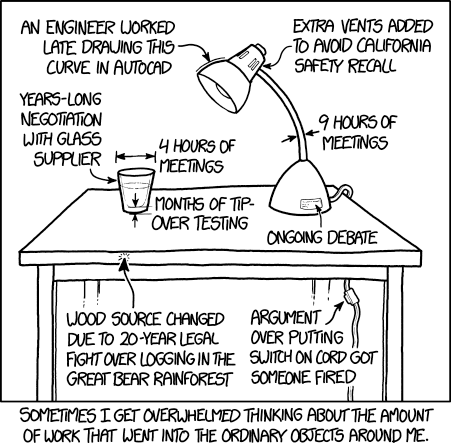
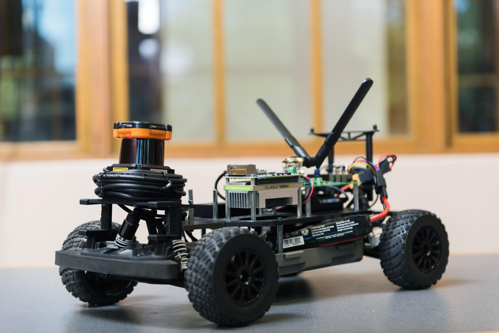
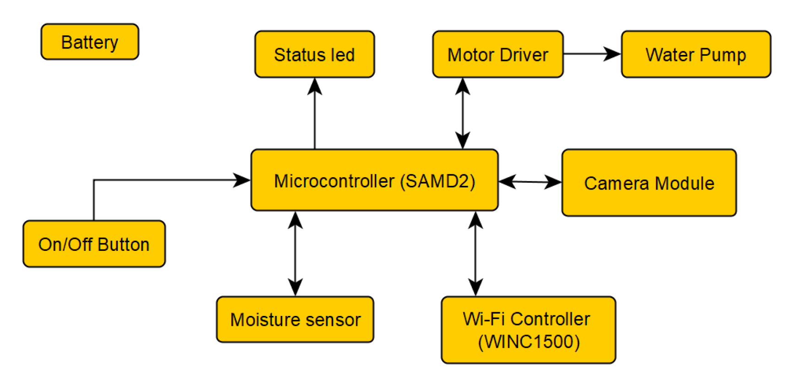
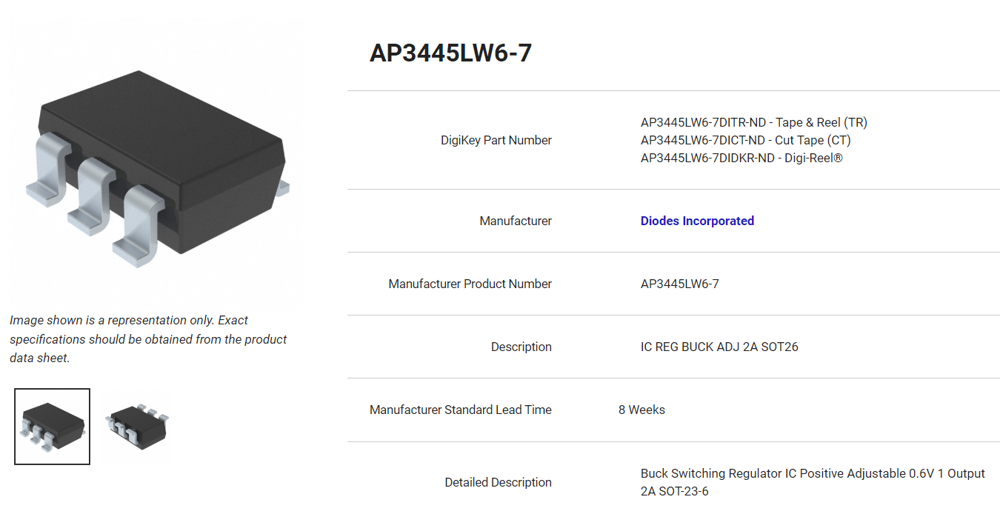
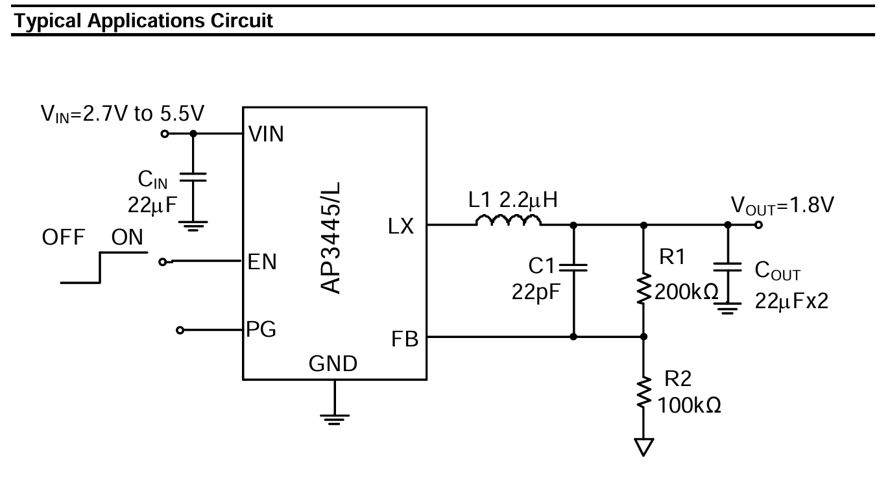
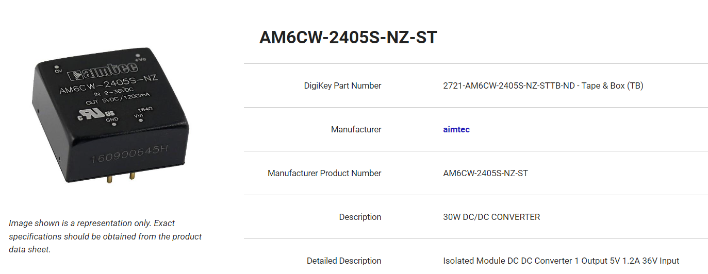
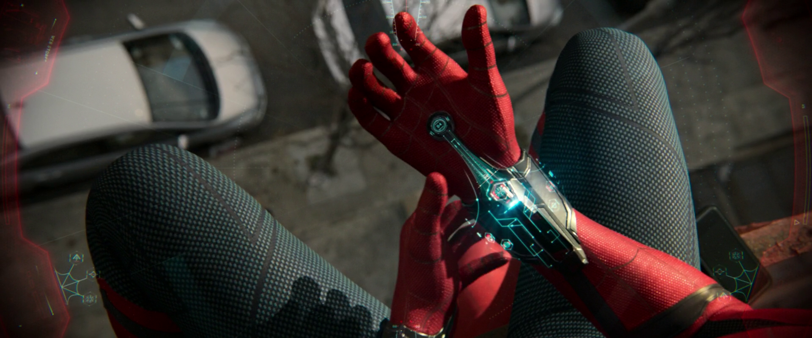

Summer Hardware Practicum

Deadline: 后天晚上 12:00 前 (2-day assignment)

{width="4.697916666666667in"
height="4.65625in"}[^1]

# Overview

This worksheet focuses on design related to our first module - namely
power management and bootloading. The design questions below are quite
open-ended as the goal is for you to develop creativity and critical
thinking in designing an embedded system and not focus so much on
arriving at a correct answer - as we know, there is more than one way to
solve a design problem. Be verbose in your explanations, and reason
through your decisions as explicitly as possible.

Find the assignment repository, which includes a starter codebase for
you. Don\'t forget to review the course submission guide for details on
submitting assignments.

**All the required questions are highlighted in green.**

**Important notes are highlighted in yellow.**

An individual submission to be submitted on GitHub.

#  

# Design 1: An Autonomous Vehicle

{width="3.619792213473316in"
height="2.2370964566929135in"}[^2]

The [[F1TENTH]{.underline}](http://f1tenth.org/) vehicle requires a new
power distribution board. After going through a number of hardware
updates, there is a new set of power requirements. Given the input
voltage listed below, design a power management system that can provide
the required power to the peripherals.

Input voltage:

- 3S Lithium Polymer Battery, with a C rating and current capacity that
  far exceeds your needs

  - 3S means 3 lithium polymer cells in Series (if would be 3P if they
    were in Parallel). The "depleted" voltage for one cell is 3.0V and a
    fully charged cell sits at 4.2V.

  - **What is the 3S LiPo voltage range?** Voltage range is the lowest
    and highest voltages possible with the power source.

  - When would you connect voltage cells in series and in parallel? What
    are the tradeoffs in terms of voltage and current supplied?

Peripherals:

- LiDAR that runs on 12V and can draw up to 1A

- Jetson Xavier NX that runs on 5V and can draw up to 3A (This is the
  microprocessor!)

- Camera that runs on 5V and can draw up to 1.5A

- **For the purpose of this exercise, you may ignore the motors & motor
  control.**

First, make a simple block diagram that shows all of the important
devices included in the system. There is no need to include passive
components (capacitors, resistors, inductors) on the block diagram -
just the most critical components needed for the device to operate.
**However, don't forget to add the power regulators needed in your
system (these aren't shown in the example below).**

Below is an example of a simple block diagram used for an Internet of
Things (IoT) smart plant watering device. Create your diagram with
software, such as
[[yEd]{.underline}](https://www.yworks.com/products/yed) (used to make
the diagram below) or
[[Diagrams.net]{.underline}](https://app.diagrams.net/) (can link to
your GitHub repository!)

Only power must be routed in this diagram! Data is not required.

{width="5.197916666666667in"
height="2.4859601924759405in"}

Next, use [[Mouser]{.underline}](https://mouser.com/) or
[[DigiKey]{.underline}](https://www.digikey.com/) to source your parts.
This is also a practice in learning how to filter and look for parts. In
general, you'll want to start with "In Stock" and "Active" to ensure
parts availability and from there, narrow the search to your
specifications. **Assume you are using the peripherals listed above
(LiDAR, Jetson, Camera). We want you to work on the power configuration
for this system only.**

**You must source the parts that your power components need as well.**
E.g. If a switching regulator requires a 1.4mH inductor, 22uF capacitor,
and 1kOhm resistor, you must also source those components. When sourcing
your part, you must read the datasheets. For example, if you want a
switch in your circuit, not all switches are rated up to 5A! 🔥

Keep in mind that we want you to build a **chip-down design** - finding
a module with all parts included in a black box will not receive credit.
We want you to understand what goes into making these DC/DC regulator
power management ICs (PMICs). This is an example of what we're expecting
to see ([[link]{.underline}](https://www.digikey.com/short/zhpwqvc8)):

{width="4.203125546806649in"
height="2.1632338145231844in"}

When you review its datasheet, you'll see that it requires a few
external components to operate properly.

{width="4.467578740157481in"
height="2.4843755468066493in"}

The image below shows [[a
part]{.underline}](https://www.digikey.com/short/9mc3mt47) that would
**not** be given credit. See how everything is built into the device?

{width="4.526042213473316in"
height="1.7427865266841644in"}

Justify your design and parts decisions. Essentially, this question asks
you to look into the components that make up voltage regulators, but you
can expand on this design. Possible designs can range from very simple
(one or two ICs) to a bit more complicated. For example, do you want to
have switches? Do you want to make this the least expensive design, most
efficient, or smallest?

The [[WEBENCH Power
Designer]{.underline}](https://www.ti.com/design-resources/design-tools-simulation/webench-power-designer.html)
and [[ST
eDesignSuite]{.underline}](https://www.st.com/content/st_com/en/support/resources/edesign.html)
may be helpful in creating power supply circuits. Cite your work! If
using these resources, run simulations and copy the circuit details into
the assignment submission.

Use the provided WS1 - Power - Sample BOM.xlsx to record your parts in
the Design 1 tab.

## Submission

(S1) A simple block diagram representing Design 1. Commit the source
file and embed an image of the block diagram in the README.md file. Only
power wiring is required.

(R1) Fill out your part choices in the Design 1 tab of WS1 - Power -
Sample BOM.xlsx.

(R2) A written explanation of your part choices in the README.md file.

# Design 2: Peter Parker Needs Your Help

{width="4.694580052493438in"
height="1.9552876202974627in"}[^3]

Peter Parker is a technical genius, but he needs your help because he is
short on time. He wants to redesign his web shooters since they're
getting a bit old and outdated and keeps running out of power. He's
tired of having to carry around a backpack full of extra web shooters
and back up batteries along. He doesn't have time to make changes on the
web chemistry or physical mechanism. His focus is on changing the
electronics for now. Fighting crime is time sensitive!

Peter wants to upgrade his web shooter to include a few new features:

1.  Speaker to play music (every superhero needs a cool entry
    soundtrack!)

2.  Heart rate monitor (everyone is on the fitness trend now and Peter
    refuses to be left out)

3.  High Power LED (crime usually happens in dark or dimly lit
    locations)

4.  Voice recorder (so he can keep a diary of his adventures and write
    his novel when he retires)

His web shooter requires an input voltage of 5V and can draw up to 200mA
in order to function properly. He found a slim and fancy DC power supply
that outputs 20V and a max current of 5A.

As with Design 1, first make a simple block diagram that shows all of
the important devices included in the system. There is no need to
include passive components (capacitors, resistors, inductors) - just the
most critical components needed for the device to operate. Both power
and data must be routed in this diagram.

Next, using [[DigiKey]{.underline}](https://www.digikey.com/) to find
parts that satisfy his requirements above (the sensors, actuators).
Namely, pick out a sensor or IC for each of the points above and explain
why you chose each part. There is no one correct answer. This question
is to help you gain familiarity with searching for components on DigiKey
based on a set of requirements. Pro tip:
[[Adafruit]{.underline}](http://adafruit.com/), and
[[Sparkfun]{.underline}](https://sparkfun.com/) have most/all of their
components listed for sale, so you might also enjoy starting with those
websites first, then searching their part number on DigiKey.

For this question, you do not need to also search for the required
passives of the ICs, such as capacitors, resistors, and inductors - we
shall assume these are just all given. For example, if the heart rate
monitor that you picked requires 2 capacitors, 1 inductor, and an op amp
according to the data sheet, we'll assume this all comes in a package.

Furthermore, consider the power management required to power all the
components you picked in addition to the 5V web shooter. You DO need to
source the required passive for power management.

Assume that the MCU you are given is the ATMega328PB.

Here are a few design questions to think about:

- Does physical size matter? E.g., If you need a linear voltage
  regulator, should you pick a through-hole part or a surface mount
  part?

- How bright should the LED be? How does that affect the part choice?

- Do you need any voltage regulators? If so, what kind?

- Would a low-voltage detector be useful?

Feel free to add extra features as well. Peter has decided that he is
committed to carrying a backpack around (he always has a packed lunch
and a filled water bottle as well as some cookies), so for all we know,
he probably carries around a full-sized oscilloscope. We will assume
that he has no problem carrying a bunch of gadgets around.

Unfortunately, Peter Parker is not allowed to own a smartwatch, so zero
points will be given if a link to a smartwatch is included on the BOM.

Use the same WS1 - Power - Sample BOM.xlsx to record your parts in the
Design 2 tab.

## Submission

(S2) A simple block diagram representing Design 2. Commit the source
file and embed an image of the block diagram in the README.md file. Both
power and data should be routed.

(R3) Fill out your part choices in the Design 2 tab of WS1 - Power -
Sample BOM.xlsx.

(R4) A written explanation of your part choices in the README.md file.

# Short Answers

(R5) What are two ways to step down the voltage of a DC power supply to
a predetermined level?

(R6) List 3 advantages and 3 disadvantages for each method.

(R7) Describe a situation where you would prefer the first method over
the second.

(R8) Describe a situation where you would prefer the second method
instead.

# [Submission Requirements]{.underline}

You will submit your assignment through your GitHub repository commits.
See the course submission guide for more information about the
submission process.

#  

# [Grading Rubric]{.underline}

Only the README.md and linked files in your GitHub repository will be
graded. If your solution(s) used any additional files or dependencies,
you MUST specify this in your README.md.

+:-----------------+:-----------------+:-----------------+:---------------+
| Questions        | Points           | Number           | Total          |
+------------------+------------------+------------------+----------------+
| R5-R8            | 2 pt(s)          | 4                | 2 x 4 = 8      |
|                  |                  |                  | pt(s)          |
+------------------+------------------+------------------+----------------+
| R1-R4            | 6 pt(s)          | 4                | 6 x 4 = 24     |
|                  |                  |                  | pt(s)          |
+------------------+------------------+------------------+----------------+
| S1-S2            | 6 pt(s)          | 2                | 6 x 2 = 12     |
|                  |                  |                  | pt(s)          |
+------------------+------------------+------------------+----------------+
| Grand Total                                            | 44 points      |
+--------------------------------------------------------+----------------+

[^1]: [[https://xkcd.com/1741/]{.underline}](https://xkcd.com/1741/)

[^2]: [[https://www.wired.com/story/small-cars-help-drive-autonomous-future/]{.underline}](https://www.wired.com/story/small-cars-help-drive-autonomous-future/)

[^3]: [[https://marvelcinematicuniverse.fandom.com/wiki/Web-Shooters]{.underline}](https://marvelcinematicuniverse.fandom.com/wiki/Web-Shooters)
